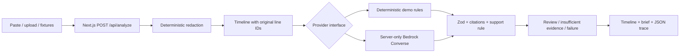

# ResQ — Evidence-first AI production incident analyst

Turn an incident log bundle into a redacted timeline, cited failure-mechanism hypothesis, and reviewable incident brief. ResQ is intentionally willing to say **cause unconfirmed**.

**Submission status:** local deterministic demo implemented and exercised. A server-side Amazon Bedrock Converse adapter is implemented and tested with a fake transport. **No actual AWS calls were exercised in this development session.** No cloud deployment, model quality benchmark, or production readiness is claimed.

## 60-second judge quickstart

Prerequisite: **Node.js 22.18+ (Node 24 recommended)** and npm. Clone this repository, then run this single command from its root:

```sh
npm run demo
```

It installs the locked frontend dependencies if absent, then starts the local demo at **http://127.0.0.1:3000**. The first installation/compilation can take longer than 60 seconds: warm it before the presentation. Registry access is needed for installation; the installed demo makes **no external service or AWS requests** and uses system fonts. Stop with Ctrl+C.

1. Click **Payment outage**, then **Analyze incident**.
2. Inspect `READY_FOR_REVIEW`: saturation at **E0003** plus a matching timeout at **E0004** support pool exhaustion. Click either citation to jump to the original redacted line. The deployment is **not** asserted to be the cause.
3. Click **Ambiguous incident** and analyze: expect `NEEDS_MORE_EVIDENCE`, **cause unconfirmed**, and low qualitative confidence.
4. Try **Redaction test** to remove six synthetic values. Real-looking example credentials appear only in this explicitly labelled test fixture.
5. Use **Export brief .md** or **Export trace .json**. If a browser blocks downloads, the export is also shown in a selectable text area.

Paste your own evidence or load a `.txt` / `.log` file. Known secret/PII patterns are redacted in the input preview and again on the server. Review before submission: this is pattern matching, not comprehensive privacy protection.

## What is implemented and what is verified

| Capability | Evidence / status |
|---|---|
| Local fixture → API → provider → validation → UI | Payment, ambiguous and redaction fixtures exercised in browser; pipeline and HTTP-handler tests |
| Secret/PII pattern redaction | Tests cover bearer/basic headers, common secret keys, AWS access-key IDs, JWTs, URL credentials, email, IPs, labelled personal fields, SSN-shaped IDs and multiline private keys |
| Stable timeline IDs and linked source lines | Deterministic tests; browser citation jump to `#E0003`; original line numbers retained |
| Schema and citation enforcement | Zod runtime validation; unknown IDs, malformed output, unsupported facts/root statements rejected in tests |
| Insufficient-evidence and failure paths | Ambiguous case, missing evidence, invalid input, bad output, provider errors and timeout tested |
| Bedrock request construction | Fake transport test of `ConverseCommand`; **no live AWS inference verified** |
| Real backend status | `/api/status` reports configuration. Bedrock remains “connectivity unverified” until a validated response for the current run |
| Incident brief and execution trace | Reproducible files in [`docs/samples`](docs/samples); export preview verified in browser; embedded-browser download-event confirmation unavailable |
| Lint, typecheck, production build, tests | See exact local results in [`docs/VERIFICATION.md`](docs/VERIFICATION.md) |
| CI | Workflow supplied in [`.github/workflows/verify.yml`](.github/workflows/verify.yml); hosted run not claimed |
| Public/cloud deployment, auth, durable storage, remediation | Not implemented or exercised |

Initial inventory and the clean base revision are recorded in [`docs/INITIAL-INVENTORY.md`](docs/INITIAL-INVENTORY.md).

## Architecture



The typed orchestration state and timestamped transitions are explicit:

```text
RECEIVED → REDACTED → TIMELINE_BUILT → ANALYZED → VERIFIED → READY_FOR_REVIEW
                              └──────────────────────────→ NEEDS_MORE_EVIDENCE
                                                VERIFIED → NEEDS_MORE_EVIDENCE
Any nonterminal stage → FAILED
```

Fewer than two evidence lines take the first insufficient-evidence path without invoking a provider. A valid `unconfirmed` analysis takes the second after verification. Malformed output, invented citations and unsupported claims take `FAILED`; no demo fallback is substituted for a Bedrock failure.

- [`frontend/lib/schema.ts`](frontend/lib/schema.ts): typed runtime schema and result types. Severity, verbatim observed facts with IDs, root hypothesis with IDs, alternatives, qualified confidence, next checks, mitigations and limitations. Backend/model identity is assigned by the server outside model-controlled content.
- [`evidence.ts`](frontend/lib/evidence.ts): newline-preserving redaction, timestamp parsing/sorting and deterministic support rule. `E0003` means original line 3 **within this submitted bundle**, not a globally unique event. Re-running an unchanged bundle preserves IDs; inserting source lines changes subsequent IDs. Untimestamped lines are retained at the end with a warning; no times are invented.
- [`orchestrator.ts`](frontend/lib/orchestrator.ts): explicit transition table, abortable 20-second inference deadline, fail-closed results.
- [`validation.ts`](frontend/lib/validation.ts): strict shape validation, all structured citations checked, exact-quote facts and constrained causal support.
- [`providers`](frontend/lib/providers): interchangeable demo and Bedrock implementations. AWS modules are marked `server-only` and use the SDK default credential chain. Credentials never enter browser configuration.
- [`brief.ts`](frontend/lib/brief.ts): redacted Markdown brief; JSON export includes the complete timeline and state trace. No raw evidence is persisted by application code.

No workflow framework, database, S3, Lambda, Step Functions, or autonomous remediation is part of this vertical slice.

## Evidence policy — deliberately narrow

The supported mechanism is **database connection pool exhaustion**, with a canonical qualified statement. It requires two distinct, strict timestamped `key=value` log lines:

1. A WARN/ERROR/CRITICAL line with `service`, numeric `db_connections >= max_connections > 0`.
2. An ERROR/CRITICAL `error=ConnectionPoolTimeout` for the **same service**, at or after saturation, within 15 minutes.

The cited subset must itself meet the rule. High occupancy alone, an unrelated service, reversed time order, a deployment followed by errors, or text merely mentioning the error does not pass. Other formats remain visible evidence but cannot establish this mechanism. Bedrock may conservatively return unconfirmed even where a mechanism is supportable.

**This is not general semantic entailment or proof of an underlying cause.** The pool mechanism could arise from a leak, traffic, slow queries, or another trigger. Those are unverified alternatives. Severity reflects accepted structured log levels, not independently measured customer impact. Confidence is **low/moderate qualitative support, not a calibrated probability**. The validator owns the confidence qualification and baseline limitations. The model's suggested checks and mitigations are not independently verified and never executed.

## Demo mode versus AWS

| | Deterministic demo | Bedrock |
|---|---|---|
| Provider | `deterministic-rules-v1` | Configured `BEDROCK_MODEL_ID` |
| Network inference | None | One server-side Converse request per eligible analysis |
| Credentials | None | IAM role / AWS profile / SDK default chain |
| Output policy | Same schema and validator | Same schema and validator |
| Failure | Visible error / insufficient evidence | Visible error / insufficient evidence; no fallback |
| Actual live validation here | Completed locally | **Not performed** |

`npm run demo` **always forces demo mode**, even if AWS variables exist. To use Bedrock, copy [`frontend/.env.example`](frontend/.env.example) to `frontend/.env.local`, set `RESQ_PROVIDER=bedrock`, `AWS_REGION`, and a model or inference-profile ID accessible in that region. Authenticate through your normal AWS profile or a host IAM role. Never use `NEXT_PUBLIC_*` for secrets; the old `NEXT_PUBLIC_API_URL` is no longer used.

The adapter follows the [AWS JavaScript Converse examples](https://docs.aws.amazon.com/code-library/latest/ug/javascript_3_bedrock-runtime_code_examples.html). The required inference permission is `bedrock:InvokeModel`; model access, IAM and any inference-profile resources must be configured for the selected model. See the [Converse API reference](https://docs.aws.amazon.com/bedrock/latest/APIReference/API_runtime_Converse.html).

### How to validate your AWS integration

1. Obtain model access and least-privilege invocation permissions in your own AWS account; configure the server environment as above. Credentials/model services were absent here, so these steps were not performed.
2. Stop the demo server. Run `npm run build`, then `npm --prefix frontend start`. These commands honor `frontend/.env.local` and do not force demo mode.
3. Visit `/api/status`: expect `kind: "bedrock"`, `configured: true`, and `connectivityVerified: false`. This is a configuration report, not a health probe.
4. In another terminal at repository root, run:

   ```sh
   npm run verify:bedrock
   ```

   This invokes both synthetic fixtures against the local server, refuses demo mode, checks the two expected states, and writes `docs/local-validation/bedrock.json` (gitignored). Set `RESQ_BASE_URL` only if using your own different server.
5. Review the saved results and AWS-side invocation records, including the actual model, region and date. Save a sanitized validation record before updating the feature-status claim. A 502/504 is a failed invocation/validation, not a successful AWS demo. Check model access, credential expiry, output schema, truncation and timeout. There are no automatic retries.

## Reproduce the sample outputs and checks

After installing dependencies (automatically via the demo command, or `npm --prefix frontend ci --ignore-scripts`):

```sh
npm test
npm run lint
npm run typecheck
npm run build
npm run samples
```

Tests use Node's built-in test runner and TypeScript stripping. No test framework or AWS credentials are required. The Bedrock tests use a **fake transport**, explicitly not a cloud run.

| Fixture | Expected state | Root outcome | Artifacts |
|---|---|---|---|
| Well-evidenced payment outage | `READY_FOR_REVIEW` | Pool exhaustion mechanism; trigger unconfirmed; E0003/E0004 | [JSON](docs/samples/well-evidenced.json), [brief](docs/samples/well-evidenced.md) |
| Ambiguous incident | `NEEDS_MORE_EVIDENCE` | Cause unconfirmed; no causal citations | [JSON](docs/samples/ambiguous.json), [brief](docs/samples/ambiguous.md) |
| Synthetic redaction test | `NEEDS_MORE_EVIDENCE` | Cause unconfirmed; six replacements | [JSON](docs/samples/redaction-test.json), [brief](docs/samples/redaction-test.md) |

The sample generator uses an explicitly fixed **test clock** (`2026-09-24T00:00:00Z`) for diffable artifacts. It is not the claimed wall-clock time of a run. The live UI uses actual processing timestamps. Input log timestamps are synthetic incident timestamps.

## Capture a screenshot or recording

Actual local demo capture: [view screenshot](docs/screenshots/demo.png). Captured from the running app on 2026-09-25 with the deterministic demo label visible.

Warm `npm run demo`, open the app at normal browser zoom, load Payment outage, analyze, and capture the hypothesis plus its backend label. Click E0003 and capture the timeline. Record the ambiguous run as well so the refusal behavior is visible. Use only bundled synthetic data. Include the **demo-mode label** in footage; do not present it as Bedrock inference.

Use the [three-minute script](docs/JUDGE-SCRIPT.md). No benchmark score, judge feedback, or cloud footage is claimed. The [verification record](docs/VERIFICATION.md) separates UI observations from unverified download/cloud behavior.

## Project layout and deployment

`frontend/` is the **only supported application**. `demo/frontend/` is an older untouched starter retained to preserve history; its README now points here. Do not deploy that directory. Root npm scripts delegate to `frontend`; the local demo runner uses Next's public custom-server API to avoid child-process IPC restrictions observed on Windows. The production app uses standard `next build` / `next start`. Thread workers and the TypeScript API checker are configured because the default CLI checker could not launch in the restricted environment; type checking is still enabled.

Deploy the `frontend` directory on a Node-capable Next.js host with fixture-file tracing included. Static-only hosting is insufficient for the API. Supply server-only variables and IAM access before enabling Bedrock. No existing deployment configuration or AWS infrastructure was found, and no deployment was attempted. See [remaining blockers](docs/VERIFICATION.md).

## Known limits

- Small single-bundle review: 64,000 characters, 200 source lines, 2,000 characters per redacted evidence line; upload limited to 64 KB. API body cap is 256 KB for JSON encoding overhead. Very large model responses/truncation fail closed.
- Regex redaction can miss free-form names, novel token formats and sensitive business context; it can also redact benign patterns. Raw pasted data briefly exists in the input event; direct API requests reach server memory before redaction. Infrastructure request logging must be configured appropriately. No compliance certification is implied.
- Logs can be false, incomplete or adversarial. Structural citation correctness and a narrow support rule do not establish ground truth. No automated action is taken.
- Demo facts are limited to the first 12 chronological lines; the complete timeline is always retained. Untimestamped/unstructured records are not used by the mechanism rule.
- No authentication, durable audit store, distributed rate limiting, cost controls, multi-user isolation or production hardening. Keep Bedrock mode private until those controls are supplied by the deployment environment.
- Hosted CI, cross-platform fresh installs and live Bedrock invocation require your validation. Browser download confirmation was limited by the embedded browser; selectable export content and reproducible CLI samples remain available.

## Similar name, different project

[AdityaP9116/ResQ-AI](https://github.com/AdityaP9116/ResQ-AI) is a separate disaster-response drone project. Only its public documentation was inspected for ideas about reproducible launch commands, execution traces and claim-to-evidence documentation. No code, assets, claims or drone architecture were copied. This repository analyzes production incident evidence.
